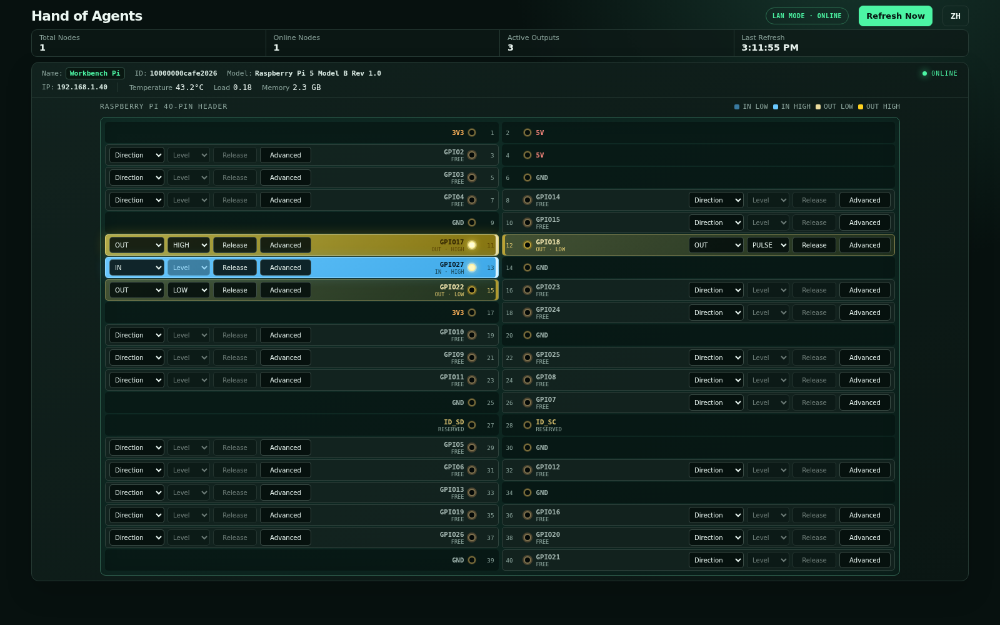

# Hand of Agents

一个面向 Agent 的树莓派 GPIO 控制框架。Host Server 提供网页、REST/OpenAPI 和审计记录；树莓派 Client 主动连接 Server，执行经过配置白名单约束的 GPIO 命令，并持续上报节点、系统和 IO 状态。

## 界面预览



## 架构

```text
Agent / Browser
      │  REST (optional X-API-Key)
      ▼
FastAPI Host Server ─── SQLite audit log
      ▲
      │  authenticated WebSocket
      │  commands / acknowledgements / telemetry
      ▼
Raspberry Pi Client ─── gpiozero ─── relay / sensor
```

- Client 主动连接 Host，局域网里无需向树莓派开放控制 API。
- Server 支持免密钥局域网模式，也可要求 `X-API-Key`；每个节点的 WebSocket 始终使用后台配置的独立 `X-Node-Token`，用户操作时无需输入节点 token。
- `raspberry-pi-40pin` 配置会列出 26 个通用 GPIO，物理 27/28 脚作为 HAT ID 保留，不开放控制。
- GPIO 初始保持 `unconfigured`，网页或 API 明确配置后才会被程序申请，避免启动时抢占 I²C、SPI 和 UART 复用引脚。
- Client 启动、断线、退出或命令脉冲结束时，输出回到各自的 `safe_state`。
- Server 把连接与命令审计写入 SQLite，前端每 2 秒刷新节点状态。
- 节点显示名默认为 `Pi`，可在网页中点击名称重命名；名称由 Host SQLite 持久保存，不改变内部 `node_id`、连接地址或 token。
- Client 优先从设备树读取树莓派板级序列号，回退到 `/proc/cpuinfo` 的 `Serial`，并在设备摘要中作为只读 `id` 显示。

## 本机启动 Server

需要 Python 3.11+：

```zsh
python3 -m venv .venv
.venv/bin/pip install -e '.[server,dev]'
cp .env.example .env
```

编辑 `.env`。仅在可信局域网使用时可设 `HOA_AUTH_MODE=none`，网页和 API 无需密钥；设为 `api_key` 时务必更换示例密钥：

```zsh
chmod +x scripts/*.zsh
./scripts/run-server.zsh
```

打开 `http://HOST_IP:8000/` 查看面板，OpenAPI 位于 `http://HOST_IP:8000/docs`。

节点头部以两行设备摘要显示可重命名名称、由 Host 连接端确认的 IP、板级序列号、型号及遥测信息；内部节点 ID 不在页面显示。面板默认使用英文，右上角的 `ZH`/`EN` 按钮可切换中英文，选择会保存在当前浏览器中。排针图中的每个 GPIO 都带有独立的 `Direction`、`Level` 下拉和一键“释放”按钮；输入上下拉等完整参数通过引脚框内的“高级”按钮设置。

如需随桌面用户会话自动启动，可链接仓库内的 user service：

```zsh
systemctl --user link "$PWD/deployment/hand-of-agents-server-user.service"
systemctl --user enable --now hand-of-agents-server-user.service
```

如果希望注销后仍保持服务运行，需要管理员执行 `loginctl enable-linger USERNAME`；也可以改用 [deployment/hand-of-agents-server.service](deployment/hand-of-agents-server.service) 安装为系统服务。

## 树莓派 Client

复制 `configs/pi-lab.toml.example` 并按实际接线填写。`board_profile = "raspberry-pi-40pin"` 会自动生成排针图和 26 个可操作 GPIO；单独的 `[[pins]]` 条目可覆盖名称、默认模式及安全状态。引脚编号统一采用 BCM。继电器板常见低电平触发，此时应设置 `active_high = false`，但必须以实际模块规格为准。

```zsh
python3 -m venv .venv
.venv/bin/pip install -e '.[pi]'
cp configs/pi-lab.toml.example client.toml
.venv/bin/hoa-client --config client.toml
```

没有 GPIO 的开发机将 `gpio_backend` 改为 `mock`。生产部署可使用 [deployment/hand-of-agents-client.service](deployment/hand-of-agents-client.service) 作为 systemd 模板。

## Agent API

当前部署使用 `HOA_AUTH_MODE=none`，以下请求无需 token。若切换为 `api_key`，给写操作及审计请求增加 `X-API-Key` 请求头。

```zsh
# 节点状态
curl http://192.168.1.40:8000/api/v1/nodes

# 修改节点显示名；pi-lab 是内部 node_id，不会随显示名改变
curl -X POST \
  -H 'Content-Type: application/json' \
  -d '{"name":"Bench Pi"}' \
  http://192.168.1.40:8000/api/v1/nodes/pi-lab/name

# 将 GPIO17（物理 11 脚）配置为输出；初始化为 safe_state
curl -X POST \
  -H 'Content-Type: application/json' \
  -d '{"action":"configure","direction":"output"}' \
  http://192.168.1.40:8000/api/v1/nodes/pi-lab/pins/GPIO17

# 输出 HIGH
curl -X POST \
  -H 'Content-Type: application/json' \
  -d '{"action":"set","value":true}' \
  http://192.168.1.40:8000/api/v1/nodes/pi-lab/pins/GPIO17

# 持续输出 500ms HIGH / 500ms LOW；HIGH、LOW、释放或断线会停止循环
curl -X POST \
  -H 'Content-Type: application/json' \
  -d '{"action":"pulse","duration_ms":500,"continuous":true}' \
  http://192.168.1.40:8000/api/v1/nodes/pi-lab/pins/GPIO17

# 配置为带上拉的输入
curl -X POST \
  -H 'Content-Type: application/json' \
  -d '{"action":"configure","direction":"input","pull":"up"}' \
  http://192.168.1.40:8000/api/v1/nodes/pi-lab/pins/GPIO17

# 释放引脚，恢复 FREE 状态
curl -X POST \
  -H 'Content-Type: application/json' \
  -d '{"action":"configure","direction":"unconfigured"}' \
  http://192.168.1.40:8000/api/v1/nodes/pi-lab/pins/GPIO17

# 最近的审计事件
curl 'http://192.168.1.40:8000/api/v1/events?limit=50&node_id=pi-lab'
```

节点名称接口接受 1–64 个字符，网页点击绿色名称即可重命名；`api_key` 模式下与其他写操作一样需要 `X-API-Key`。`configure` 支持 `input`、`output`、`unconfigured`，输入模式的 `pull` 支持 `up`、`down`、`floating`，并可通过 `pulse_hz` 保存该引脚的 PULSE 频率（0.1–10 Hz，默认 1 Hz）。重复确认相同的 Direction/Pull 不会重新初始化 GPIO；修改运行中 PULSE 的频率会保留当前模式和电平相位。高级弹窗会同步实际配置，Direction、Pull、频率及 HIGH/LOW/PULSE 均只在本地暂存，点击“确认”后才提交。`set` 接受布尔值，`toggle` 不需要额外字段。`pulse` 接受半周期 `duration_ms`；`continuous=true` 时持续循环，默认 `false` 时仅输出一次。网页仅在“高级”设置中编辑频率，Level 控件保持显示 PULSE，而引脚状态文字和颜色显示最近采样到的实际 HIGH/LOW。节点空闲时每 2 秒更新一次，存在连续 PULSE 时自适应为 500 ms。HTTP 2xx 代表树莓派已确认执行；节点离线返回 409，超时返回 504，非法引脚或模式错误返回 422。

## 配置参考

Server 环境变量：

| 变量 | 说明 |
| --- | --- |
| `HOA_BIND_HOST` / `HOA_BIND_PORT` | 监听地址与端口 |
| `HOA_AUTH_MODE` | `none` 免密钥操作；`api_key` 要求操作密钥 |
| `HOA_API_KEY` | Agent 和网页写操作密钥 |
| `HOA_NODE_TOKENS` | 逗号分隔的 `node-id:token` 列表 |
| `HOA_DB_PATH` | SQLite 审计库路径 |
| `HOA_CORS_ORIGINS` | 前端独立部署时允许的来源列表 |
| `HOA_COMMAND_TIMEOUT` | Server 等待 Client 确认的秒数 |

Client 的完整示例见 `configs/pi-lab.toml.example`。`gpio_backend = "auto"` 和 `gpiozero` 当前行为相同：GPIO 操作失败会明确返回错误，不会静默降级到 Mock。通用引脚默认 `safe_state = false`，为长期连接的继电器等设备添加覆盖配置，以明确触发极性和断线安全状态。

## 开发验证

```zsh
PYTHONPATH=src python3 -m pytest -q
python3 -m compileall -q src tests
```

实机测试日志放在 `logs/`，不要将 `.env`、Client token、SSH 密码或其他凭据提交到版本库。
